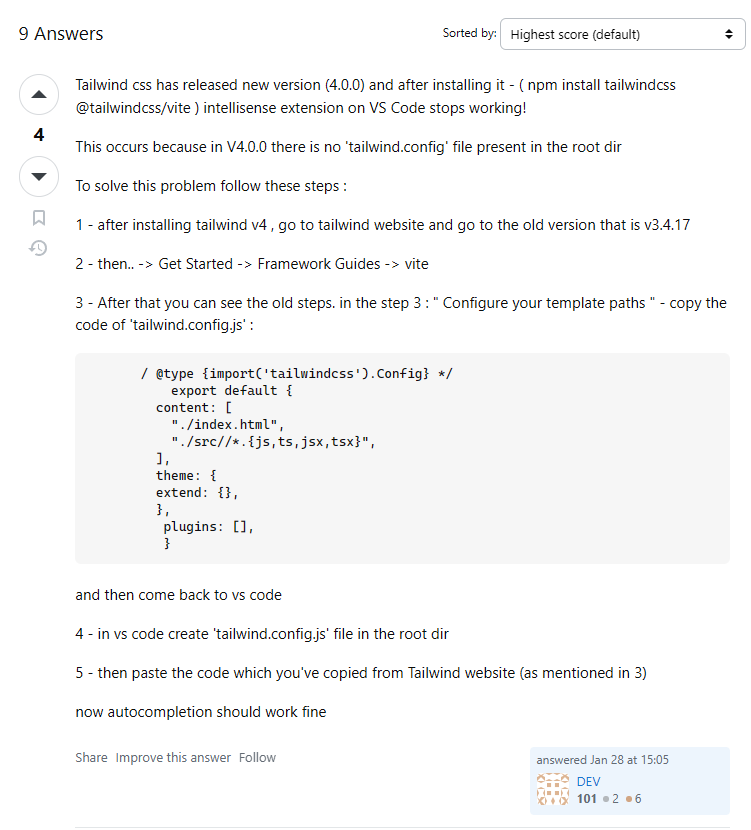

# I. How React render UI

    React will only execute a Component function one

# II. Hooks in React

## 1. useState

```js
function App() {
  let output = "Hello World!";
  function handleTabClick(btnName) {
    console.log(btnName);
    output = btnName;
  }
  return (
    <div>
      <Header />
      <main>
        <section id="core-concepts">
          <h2>Time to get started!</h2>
          <ul>
            {CORE_CONCEPTS.map((concept, _) => (
              <CoreConcept
                title={concept.title}
                desc={concept.description}
                img={concept.image}
              />
            ))}
          </ul>
        </section>
        <section id="examples">
          <h2>Examples</h2>
          <menu>
            <TabButton
              onClickFunc={() => handleTabClick("Components".toLowerCase())}
            >
              Components
            </TabButton>
            <TabButton onClickFunc={() => handleTabClick("JSX".toLowerCase())}>
              JSX
            </TabButton>
            <TabButton
              onClickFunc={() => handleTabClick("Props".toLowerCase())}
            >
              Props
            </TabButton>
            <TabButton
              onClickFunc={() => handleTabClick("State".toLowerCase())}
            >
              State
            </TabButton>
          </menu>
          <p>{output}</p>
        </section>
      </main>
    </div>
  );
}
```

Vì react chỉ render các câu lệnh (trừ các function trong onClick,...) nên
output chỉ được render 1 lần và giữ nguyên value là Hello World

-> Solution: useState

mỗi lần set trong useState được gọi -> rendering lại trang được gọi

## 2. Ref

Dùng để đọc ttin trong input field

- REF k làm cho component re-render
- REF tạo ra các instant khác nhau cho mỗi component, make sure that các instant sẽ k bị lost mỗi lần re-render

```js
export default function Player() {
  const playerName = useRef("unknown entity");
  const [enteredName, setEnteredName] = useState(undefined);
  function handleOnClick() {
    setEnteredName(playerName.current.value);
  }
  return (
    <section id="player">
      <h2>Welcome {enteredName?.length ? enteredName : "Unknown entity"}</h2>
      <p>
        <input ref={playerName} type="text" />
        <button onClick={handleOnClick}>Set Name</button>
      </p>
    </section>
  );
}
```

## 3. React Portals

manipulate DOM tree

```js
import { createPortal } from "react-dom";

export default function ResultModal({
  ref,
  remainingTime,
  targetTime,
  onReset,
  score,
}) {
  return createPortal(
    <dialog ref={ref} className="result-modal" onClose={onReset}>
      {remainingTime <= 0 ? <h2>You lost</h2> : <h2>Your score: {score}%</h2>}
      <p>
        The target time was <strong>{targetTime}</strong> seconds
      </p>
      <p>
        You stopped the timer with{" "}
        <strong>{(remainingTime / 1000).toFixed(2)} seconds left</strong>
      </p>
      <form action="" method="dialog">
        <button>Close</button>
      </form>
    </dialog>,
    document.getElementById("modal")
  );
  //   modal trong file index.html
}
```

# III. Tips

## 1. Forwarding props to wrapped elements

```js
export default function Input({ richText, ...props }) {
  // return a <textarea> if a richText prop is true
  // return an <input> otherwise
  // forward / set the received props on the returned elements
  if (richText) return <textarea {...props} />;

  return <textarea {...props} />;
}
```

## 2. JS hỗ trợ defaul prop value

## 3. public/ vs assets/ for Image Storage

1. The public/ Folder

As shown in the previous lecture you can store images in the public/ folder and then directly reference them from inside your index.html or index.css files.

The reason for that is that images (or, in general: files) stored in public/ are made publicly available by the underlying project development server & build process. Just like index.html, those files can directly be visited from inside the browser and can therefore also be requested by other files.

If you try loading localhost:5173/some-image.jpg, you'll be able to see that image (if it exists in the public/ folder, of course).

2. The src/assets/ Folder

You can also store images in the src/assets/ folder (or, actually, anywhere in the src folder).

So what's the difference compared to public/?

Any files (of any format) stored in src (or subfolders like src/assets/) are not made available to the public. They can't be accessed by website visitors. If you try loading localhost:5173/src/assets/some-image.jpg, you'll get an error.

Instead, files stored in src/ (and subfolders) can be used in your code files. Images imported into code files are then picked up by the underlying build process, potentially optimized, and kind of "injected" into the public/ folder right before serving the website. Links to those images are automatically generated and used in the places where you referenced the imported images.

3. Which Folder Should You Use?

You should use the public/ folder for any images that should not be handled by the build process and that should be generally available. Good candidates are images used directly in the index.html file or favicons.

On the other hand, images that are used inside of components should typically be stored in the src/ folder (e.g., in src/assets/).

## 4. Update state

NOT rcm: setIsEditing(!isEditing)
HIGHLY rcm: setIsEditing(wasEditing => !wasEditing)

explain:

    vì react is scheduling state updates
    nếu setIsEditing(true), sẽ trong 1 khoảng tgian tlai mới thực hiện -> có trg hợp lỗi
    nếu setIsEditing(wasEditing => !wasEditing), param là 1 function -> instantly

    trg hợp lỗi (isEditing = false)
    setIsEditing(!isEditing)
    setIsEditing(!isEditing)  -> chưa kịp cập nhật, vẫn là false
    -> final res, isEditing = true -> error

## 5. <input>

```js
// nếu dùng value t
<input
  type="text"
  defaultValue={userName}
  // error for value, bởi sẽ tự động ghi đè, nên sẽ sử dụng defaultValue (initial value)
  // value = {userName}
/>
```

## 6. shallow copy, deep copy

shallow copy tạo bảng copy ref tới các object thuộc array gốc

```js
// arr
const originalArray = [{ name: "Alice" }, { name: "Bob" }];

const shallowCopy = [...originalArray]; // Tạo bản sao mảng nhưng không sao chép các object bên trong

shallowCopy[0].name = "Charlie"; // Thay đổi object trong mảng con

console.log(originalArray[0].name); // "Charlie" ❌ Bị ảnh hưởng!
console.log(shallowCopy[0].name); // "Charlie"
```

deep copy - tạo 1 bản sao hoàn toàn cách biệt

    search more on chatGPT, rcm the best way
    const newGameBoard = structuredClone(prevGameBoard);
    Cách tốt nhất nếu trình duyệt/node.js của bạn hỗ trợ.

## 7. Cách React và css hoạt động

```css
#log {
  max-width: 20rem;
  color: #3f3b00;
  list-style: none;
  margin: 2rem auto;
  padding: 0;
  text-align: center;
}

#log li {
  border-radius: 4px;
  animation: slide-in-from-left 1s cubic-bezier(0.075, 0.82, 0.165, 1) forwards;
  margin: 0.75rem;
}
```

```js
    <ol id="log">
      {gameTurns.map((turn) => (
        <li
          //   key={${turn.square.row}-${turn.square.col}}
          //   key={count--}
          key={${count++}}
        >
          {${turn.player} selected (${turn.square.row}, ${turn.square.col})}
        </li>
      ))}
    </ol>
```

Câu hỏi: Tại sao animation: slide-in-from-left hoạt động khác nhau khi thay đổi key?

Lý do: React Render Optimization & Key Reconciliation

1. Khi sử dụng key={\${turn.square.row}-${turn.square.col}}

Cách hoạt động của React:

    Khi bạn thêm một nước đi mới, danh sách gameTurns được cập nhật với phần tử mới ở cuối danh sách.

    Các phần tử trước đó giữ nguyên key của chúng, nên React chỉ thêm phần tử mới vào mà không động vào các phần tử cũ.

    Kết quả: React chỉ thêm một phần tử vào cuối danh sách và không làm ảnh hưởng đến animation của các phần tử trước đó.

💡 Hiệu ứng animation:

Chỉ phần tử mới được thêm vào chạy animation slide-in-from-left, các phần tử trước đó không thay đổi.

2. Khi sử dụng key={count++} hoặc key={count--}

Cách hoạt động của React:

    Mỗi lần handleCellClick() được gọi, setGameBoard() làm thay đổi gameTurns, danh sách mới sẽ được re-render.

    Do count luôn thay đổi mỗi khi render, React nghĩ rằng toàn bộ danh sách là mới, ngay cả với những phần tử cũ.

    Kết quả: React unmount toàn bộ danh sách cũ và mount lại danh sách mới từ đầu.

💡 Hiệu ứng animation:

Vì toàn bộ danh sách bị re-mount lại, tất cả các phần tử đều bị reset animation, khiến hiệu ứng có thể giật hoặc không mượt.

## 8. Vanilla CSS are NOT scoped to components!!!

but there's 1 solution: using CSS modules

## 9. "Styled Components": third-party Package

## 10. Set up tailwind 4.0

trong tailwind 4.0, npx tailwindcss init bị bỏ -> k thể tạo file tailwind.config.js -> extension tailwind k chạy -> k thể auto complete

=> SOLUTION



# IV. Component & tailwind css

## 1. dialog

pop-up

```js
<dialog ref={ref} className="backdrop:bg-stone-900/90">
  {children}
  <form action="dialog">
    // close btn
    <button>{btnCaption}</button>
  </form>
</dialog>;

// -------------- open dialog
modelRef.current.showModal();
```
